# Electronics

These electronics were developed organicaly, and evolved from a wired version of the board.
Along the prototyping process, I switched from an arduino Nano as the longboard controller to an arduino Pro mini 3.3v for both systems.

## Schematic

You can download a PDF version of the schematic [here](./media/CimmerDown_schematic.pdf).

## Construction

Physically constructing the boards will require some [perfboard](https://en.wikipedia.org/wiki/Perfboard), all the components, and some soldering.

Cere is a list of the electrical components to assemble before beginning on making the boards:

| Component | Symbol | Quantity | Description |
| --- | --- | --- | --- |
| 10k ohm resistor | R[1-5] | 5 | standard through-hole |
| 100k ohm resistor | R[6-7] | 2 | standard through-hole  |
| 3k ohm resistor | R[8] | 1 | standard through-hole |
| 20k ohm resistor | R[9] | 1 | standard through-hole |
| status LED | D1 | 1 | standard through-hole; color of your choice! |
| Battery | BT[1-3] | 3 | CNHL 5.9Ah 3S LiPo |
| Battery | BT4 | 1 | standard 1S 18650 Li-Ion |
| CIM Motor | M[1-2] | 2 | standard |
| Arduino Pro Mini  | MOD[1-2] | 2 | 3.3v 8Mhz |
| NRF24L01+ | MOD[3-4] | 2 | standard |
| REV Robotics Spark ESC | MOD[5-6] | 2 | Obsolete and out of production |
| Analog Joystick | MOD7 | 2 | standard |
| Buck convertor | MOD8 | 1 | 12v to 5v |

Some other consumables include solid core wire, solder, and flux if you prefer.

The perfboard will need to be cut or snapped down to size. The remote requires 23x7 smd holes. The board controller requires __ x __ smd holes.

the following is one way to wire up the boards. it is not difinitively, the only way. if you think you know how to do it better, submit a PR or message me.

- [] controller
  - [] solder short side of pins to arduino Board
  - [] solder long side Pins to perfboard. Make sure they are in the right spot, according to the image
  - [] 

## PCB

A PCB version of the boards might be on the way soon, but I don't know if there's enough interest to warrant it. Lmk if you want one, and what you'd be willing to pay for it.